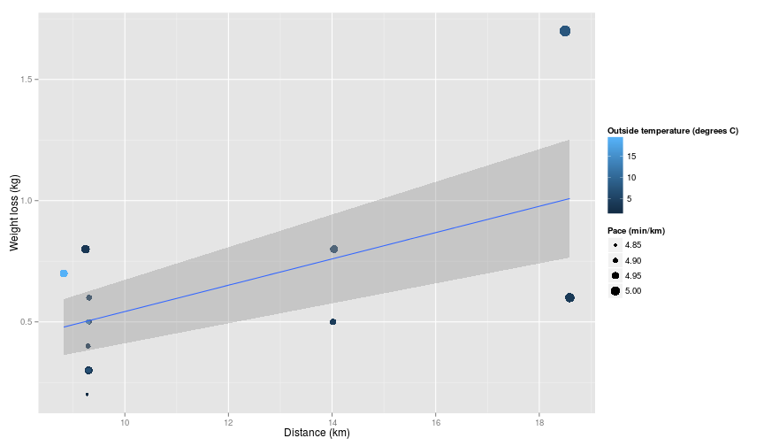

## Weight (water) loss with run distance

 

Rate of water loss is approximately 50 ml/km.

---

## Introducing the brand new shiny app for predicting water loss

Based on (0.05) decades of extensive data gathering (well, 16 of my own runs)
we have carefully calculated an average rate of water loss of 50 ml/km.

The brand new [app](https://itmustbebunnies.shinyapps.io/shinyapp) currently:
 - supports the visualization of predicted water loss during a race 
 - gives at least some idea of how much water is enough
 - allows you to adjust the water stops you make to see how dehydrated you might become if
 you don't stop
 - allows you to see what your maximum dehydration could be

Future enhancements could include tailored predictions based on sex, age, weather conditions etc.
